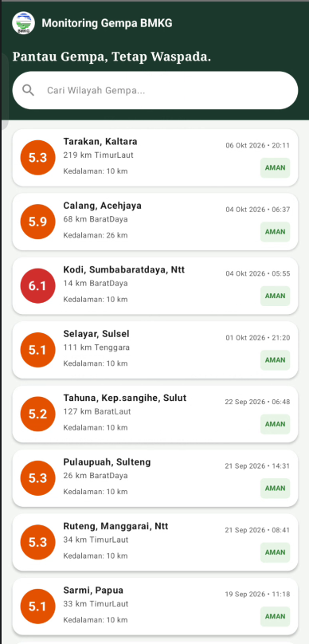
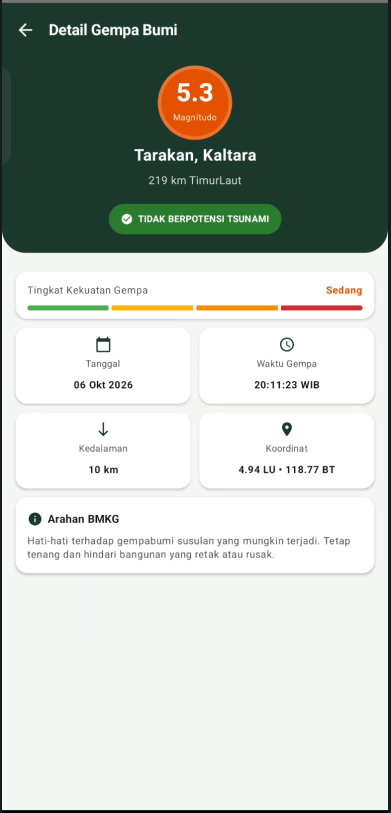

# Pemantauan Gempa BMKG

Repositori ini dibuat untuk memenuhi Tugas Responsi 1 Pemrograman Mobile.

## Identitas Praktikan

<table>
  <tr>
    <td><b>Nama</b></td>
    <td>HANA NAILA RAHMADINA</td>
  </tr>
  <tr>
    <td><b>NIM</b></td>
    <td>H1D024093</td>
  </tr>
  <tr>
    <td><b>Shift Praktikum</b></td>
    <td>SHIFT I</td>
  </tr>
</table>

## Video Penjelasan Kode
🎥 **[Tonton Video Penjelasan Kode di sini (YouTube)](https://youtu.be/0tyoCQUAWzs?si=SbzN6hCmzHgjJoRX)**

## Tampilan Aplikasi

| Home Screen | Detail Screen |
| :---: | :---: |
|  |  |

## Fitur Aplikasi

| Fitur | Deskripsi |
| --- | --- |
| Daftar Gempa | Menampilkan informasi gempa terkini dari BMKG |
| Pencarian | Mencari data gempa berdasarkan nama kota atau wilayah |
| Indikator Magnitudo | Warna indikator berubah dinamis sesuai kekuatan gempa |
| Detail Gempa | Menampilkan parameter teknis (Kedalaman, Koordinat LU/LS, Jam) |
| Potensi Tsunami | Lencana indikator status peringatan tsunami |
| Arahan Mitigasi | Panduan mitigasi keselamatan dari BMKG |

## Arsitektur & Teknis

| Komponen | Deskripsi |
| --- | --- |
| Arsitektur | MVVM (Model-View-ViewModel) dengan StateFlow |
| Bahasa Pemrograman | Kotlin |
| UI Toolkit | Jetpack Compose (Material 3) |

## Konfigurasi API

| Konfigurasi | Detail |
| --- | --- |
| Sumber Data | Open Data BMKG (Tanpa API Key) |
| Base URL | https://data.bmkg.go.id/ |
| Endpoint | /DataMKG/TEWS/gempaterkini.json |

## Library Pendukung

| Library | Kegunaan |
| --- | --- |
| Navigation Compose | Navigasi antar layar (dibatasi 2 screen) |
| Retrofit2 | HTTP Client untuk integrasi API BMKG |
| Gson Converter | Parsing data respons JSON ke dalam Data Class |
| Coroutines | Eksekusi proses background dan asinkron |

*Catatan: Sesuai dengan instruksi praktikum, aplikasi ini tidak menggunakan library pihak ketiga tambahan di luar spesifikasi (seperti Coil, Glide, dll).*
